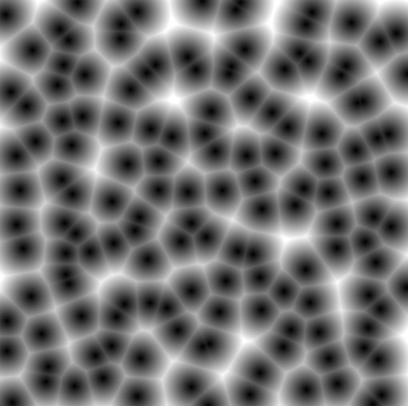

# Worley Noise

A simple and clean implementation of **Worley Noise** in **C++** using **SFML 3.0.0**

## Requirements
- C++17 or later
- [SFML 3.0.0](https://www.sfml-dev.org/download/)

## Preview

## Note
This project was built for learning and understanding Worley noise.